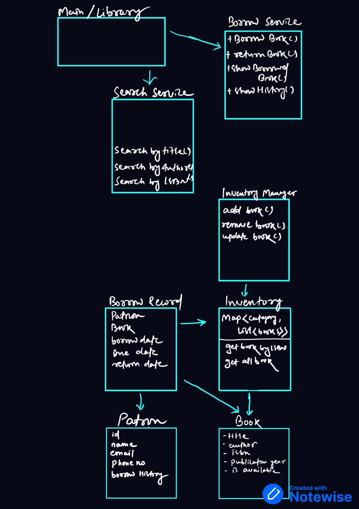

# Library Management System in Java

This is a simple Object-Oriented Library Management System built using pure Java, focusing on:

- Clean OOP principles (encapsulation, abstraction)
- SOLID design principles
- Separation of concerns

---

# Features

- Add, remove, and update books in inventory
- Search books by title, author, or ISBN
- Categorize books by string-based categories
- Add library patrons
- Borrow and return books
- Track borrow records and book availability

- # Class Diagram
- 
